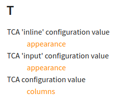

.. include:: /Includes.rst.txt
.. highlight:: rst

.. _Sphinx-Tabs:

===============
add_object_type
===============

.. contents:: This page
   :backlinks: top
   :class: compact-list
   :depth: 99
   :local:

Sphinx API app.add_object_type()
================================

.. versionadded:: v3.0.dev13 of DRC (Docker Rendering Container)

See: https://www.sphinx-doc.org/en/master/extdev/appapi.html#sphinx.application.Sphinx.add_object_type

Authors can use that function with appropriate lines in :file:`Settings.cfg`.

Define and use object types
---------------------------

In file :file:`Settings.cfg` we add, for example:

.. code-block:: ini

   [sphinx_object_types_to_add]

   # DIRECTIVE_NAME =  DIRECTIVE_NAME // TEXTROLE_NAME // OBJECT_NAME
   # Each line is used for a call of the Sphinx API function 'app.add_object_type()'
   # and creates a Sphinx directive, a Sphinx textrole and a group of index entries.
   # See: https://www.sphinx-doc.org/en/master/extdev/appapi.html#sphinx.application.Sphinx.add_object_type
   cvtca       =  cvtca        //  cvtca        //  TCA configuration value
   cvtcainline =  cvtcainline  //  cvtcainline  //  TCA 'inline' configuration value
   cvtcainput  =  cvtcainput   //  cvtcainput   //  TCA 'input' configuration value

Now we can use the directive 'cvtca' ("TCA configuration value") to conveniently
give definitions of properties of this object type 'tca':

Example for 'cvtca'
~~~~~~~~~~~~~~~~~~~

Definition line: `cvtca =  cvtca // cvtca // TCA configuration value`

.. cvtca:: columns

   The `[‘columns’]` section contains configuration for each table field (also
   called “column”) which can be edited or shown in the backend. This is
   typically the biggest part of a TCA definition.

And by means of the textrole we can conveniently link to exactly this
definition, which by design, is unique: ``"Linking to :cvtca:`columns`"`` ->
"Linking to :cvtca:`columns`.

Example for 'cvtcainline'
~~~~~~~~~~~~~~~~~~~~~~~~~

Definition line: `cvtcainline =  cvtcainline // cvtcainline // TCA 'inline' configuration value`

.. cvtcainline:: appearance

   :When:   $GLOBALS[‘TCA’][$table][‘columns’][$field][‘config’]['type'] === 'inline'
   :Path:   $GLOBALS[‘TCA’][$table][‘columns’][$field][‘config’]
   :Type:   array
   :Scope:  Display

   Has information about the appearance of child-records, namely ...

And by means of the textrole we can conveniently link to exactly this
definition: ``"Linking to :cvtcainline:`appearance`"`` ->
"Linking to :cvtcainline:`appearance`".

Example for 'cvtcainput'
~~~~~~~~~~~~~~~~~~~~~~~~

Definition line: `cvtcainput =  cvtcainput // cvtcainput // TCA 'input' configuration value`

.. cvtcainput:: appearance

   :When:   $GLOBALS[‘TCA’][$table][‘columns’][$field][‘config’]['type'] === 'input'
   :Path:   $GLOBALS[‘TCA’][$table][‘columns’][$field][‘config’]
   :Type:   array
   :Scope:  Display

   Has information about the appearance of child-records, namely ...

And by means of the textrole `:cvtcainput:` we can conveniently link to exactly
this definition: ``"Linking to :cvtcainput:`appearance`"`` ->
"Linking to :cvtcainput:`appearance`".

Automatically created index entries
~~~~~~~~~~~~~~~~~~~~~~~~~~~~~~~~~~~

And this will be the result on the index page:

